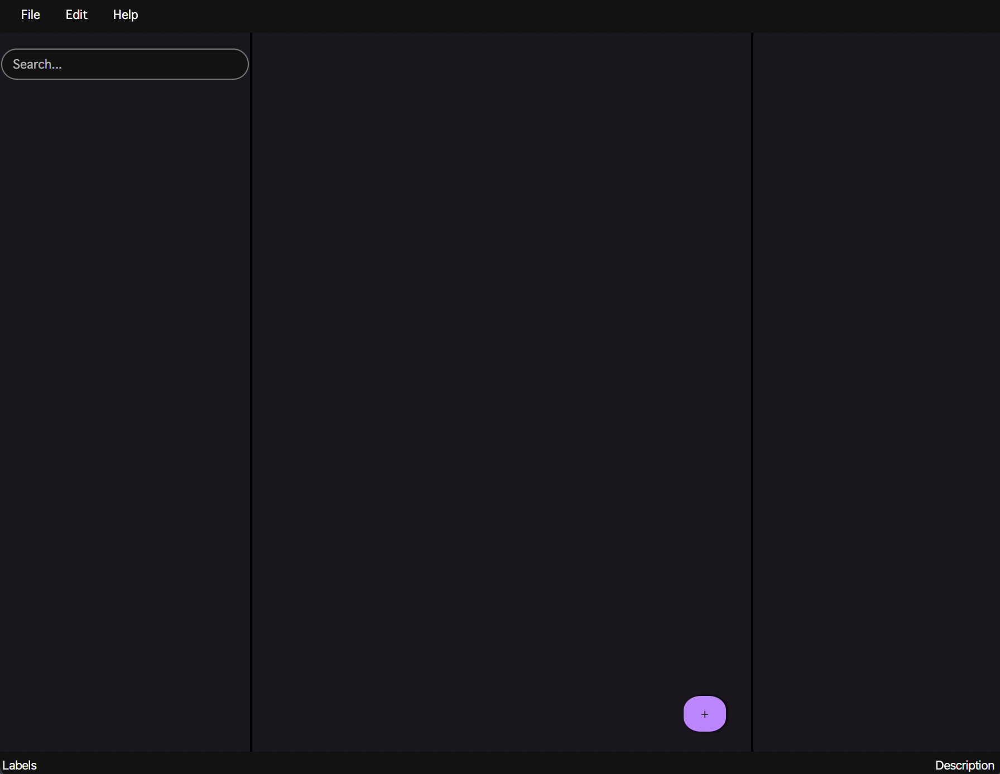
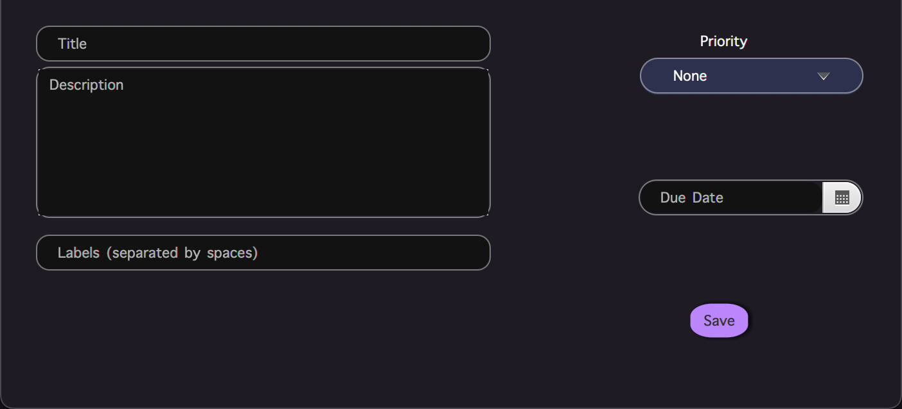

Intentions is a todo list application with productivity features. It has all the basic functionality of a todo list (eg. adding tasks, adding a due date etc). A user also has the abiltiy to toggle whether a task is in progress or not. 

# Intentions

## Team Members 
Ely Golden, Nicole Planeta and Saffiyah Mohammed.

## Visuals

## Installation
[Windows](https://git.uwaterloo.ca/ed2golde/cs346/-/blob/main/app-win.zip)
[Mac](https://git.uwaterloo.ca/ed2golde/cs346/-/blob/main/app-mac.zip)

## Usage

[Walkthrough](https://git.uwaterloo.ca/ed2golde/cs346/-/blob/main/Walkthrough.mov) 

- click plus button to add task then fill out information and click add task button to confirm
- CTRL+S to save a task
- CTRL+E to edit a task
- CTRL+BACKSPACE to delete a task
- CTRL+SHIFT+Q to move a task up
- CTRL+SHIFT+A to move a task down
- CTRL+N to create a new task
- CTRL+X to cut a task
- CTRL+C to copy a task
- CTRL+V to paste a task
- CTRL+Z to undo
- CTRL+Y to redo
- right click on a task for further menu options:
    - edit
    - cut
    - copy
    - paste
    - toggle completed
    - toggle progress
    - move up
    - move down
    - delete

## Roadmap
- timer feature
- intentions 
- productivity tracking

## Authors and acknowledgment
Ely Golden, Nicole Planeta, Saffiyah Mohammed

## Project status
Project is completed for CS 346 final demo may continue development in the future. 
